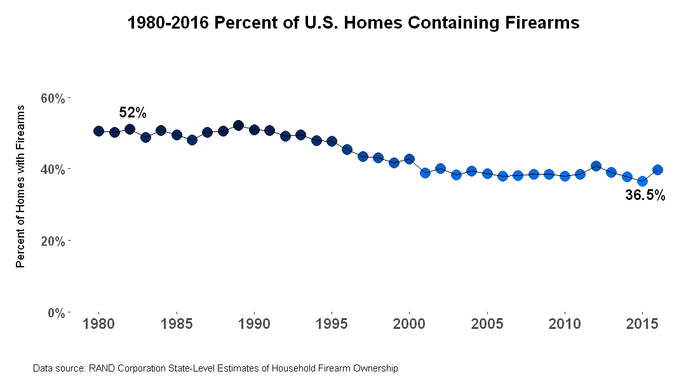

## Project Description

This project examined the prevelance of guns in U.S. homes and if it was beneficial to have a firearm for home protection. 

## Questions

Is it beneficial to keep a firearm in the home for defense?

Throughout the project additional questions arose related to accidental and deliberate firearm injuries and deaths. It was also necessary to question how many home robberies and burglaries occur.   

## Data source

The firearm ownership survey dataset for this project was retrieved from the RAND Corporation https://www.rand.org/content/dam/rand/pubs/tools/TL300/TL354/RAND_TL354.database.zip. It is part of the RAND corporation’s Gun Policy in America initiative. 

Data for U.S. burglary rates was retrieved from the U.S. Dept. of Justice Nation Crime Victim Survey https://ncvs.bjs.ojp.gov/multi-year-trends/crimeType

## Cleaning and Analytics

The dataset was structured in a multiple worksheet excel file which included information about the file, data and factor score, variable description, and data source citations. The main dataset sheet containing data and factor scores was copied to a new workbook. The data included year, state, precalculated home firearm rate estimates, standard error, if the state requires a permit to purchase in addition to ownership estimates by Gallup and Pew. Data was cleaned and saved as a comma separated value (CSV).

## Results

<<<<<<< Updated upstream

=======

>>>>>>> Stashed changes
