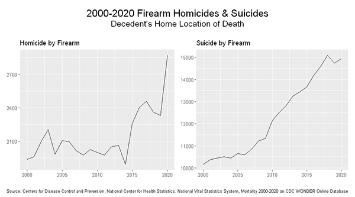

## Project Description

This project examined the prevalence of guns in U.S. homes and if it was beneficial to have a firearm for home protection. 

## Questions

Is it beneficial to keep a firearm in the home for defense?

How many accidental and deliberate home firearm injuries, deaths and suicides occur each year? 

What is the prevalence of burglaries throughout the U.S.?   

## Data source

The firearm ownership survey dataset for this project was retrieved from the RAND Corporation https://www.rand.org/content/dam/rand/pubs/tools/TL300/TL354/RAND_TL354.database.zip. It is part of the RAND corporation’s Gun Policy in America initiative. 

U.S. home burglary rates were retrieved from the U.S. Dept. of Justice Nation Crime Victim Survey https://ncvs.bjs.ojp.gov/multi-year-trends/crimeType

Firearm homicide and suicide totals were retrieved from Centers for Disease Control and Prevention, National Center for Health Statistics. National Vital Statistics System, Mortality 2000-2020 on CDC WONDER Online Database https://wonder.cdc.gov/

## Cleaning and Analytics

The firearm ownership survey dataset was structured in a multiple worksheet Excel file which included information about the file, data and factor score, variable description, and data source citations. The main dataset sheet containing data and factor scores was copied to a new workbook. The data included year, state, precalculated home firearm rate estimates, standard error, if the state requires a permit to purchase in addition to ownership estimates by Gallup and Pew. Data was cleaned and saved in a new comma separated value (CSV) file.

Home burglary data was downloaded in CSV format, included with the National Crime Victim Survey. The file contained information for the years 1993-2021 for crimes including motor vehicle theft, theft, trespassing, and burglary. Excel was used to clean the data and extract observations for crime type burglary. Data was saved as in a new CSV file.

Firearm homicide and suicide totals (specifically with the location of death in the decedent's home) were retrieved from the CDC Wonder online database. Data from homicide and suicide were downloaded separately as CSV files. Not much cleaning was needed for these files. They were both saved in new CSV files. 

## Results

Reported home firearm ownership decreased from 52% in 1982 to 36.5% in 2015. 

Home burglaries have decreased significantly from 39.8% in 1995 to 15.3% in 2015. 

A comparison of gun ownership and home burglaries.

Both firearm homicides and firearm suicides have increased significantly from 2000-2020.

